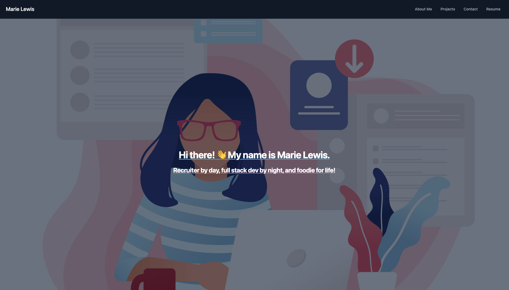

# Portfolio with React


## Table of Contents
- [Description](#description)
- [User Story](#user-story)
- [Acceptance Criteria](#acceptance-criteria)
- [Installation](#installation)
- [Usage](#usage)
- [Credits](#credits)
- [License](#license)
- [Questions](#questions)

## Description
This is my portfolio which features samples of work.

For this project, I used the following technologies to help build the user interface:

React.js

## User Story

```
AS A Jr. Developer/ Bootcamp graduate
I WANT a portfolio that showcases my past projects 
SO THAT employers can have a better assessment of my technical skills
```

## Acceptance Criteria

```
GIVEN a portfolio application
WHEN I visit the site for the first time
THEN I am presented with a nav bar with links to an About Me, Projects and Contact
```
## Installation
Please refer to the package.json for the dependencies.

## Usage

**Step 1:** Click on the different nav bar link to navigate between the pages.
**Step 2:** To send me a message, you can use the contact form in Contact.
**Step 3:** You may download my resume by going to the Resume page and clicking the download button.

[Here is the link to my portfolio application.](https://mariea1022.github.io/react-portfolio/) <br>

Below is an image of the landing page of my portfolio.


## Credits
n/a

## License

This project is covered under the MIT license.

## Contribution 
Please refer to the Contributor Covenant.

## Tests 
n/a

## Questions
Github: https://github.com/mariea1022
LinkedIn: https://www.linkedin.com/in/hrmarielewis/
